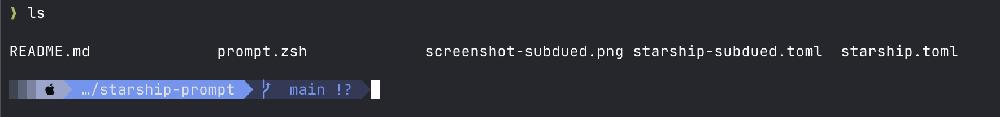

# Tokyo Night Powerline — Starship prompt

A [Starship](https://starship.rs) prompt based on the **Tokyo Night** colour scheme, with:

- **Powerline arrows** (`` / ``) instead of rounded segments
- A **single-line** left prompt: gradient block → OS icon → path → git
- A right-aligned info bar (**Jetpack-style**): language/tool versions + clock, each a self-contained pill with a left-facing `` divider
- A **blank line** between each command and its output
- A **transient prompt**: once you submit a command, its prompt collapses to a minimal green `❯ <cmd>` (like powerlevel10k)



---

## Files

| File | Purpose | Installs to |
|------|---------|-------------|
| `starship.toml` | The default (vivid) prompt definition | `~/.config/starship.toml` |
| `starship-subdued.toml` | Subdued variant — muted dark-grey main prompt (see [Variants](#variants)) | `~/.config/starship.toml` |
| `prompt.zsh`    | zsh glue: starship init + blank-line hook + transient-prompt widget | sourced from `~/.zshrc` |

> Pick **one** `.toml` to install as `~/.config/starship.toml`. Both share the same `prompt.zsh`.

---

## Variants

Two colour schemes are included. They differ only in the **left (main) prompt** — the right-side info bar, blank-line spacing, and transient prompt are identical.

| | `starship.toml` (default) | `starship-subdued.toml` |
|---|---|---|
| Main prompt | Vivid: light gradient → blue cwd → navy git | Muted dark blue-greys, colour carried by soft text |
| cwd background | `#769ff0` (bright blue) | `#383d5c` (slate) |
| Feel | Attention-grabbing | Calm / low-key |

The **subdued** variant uses three subtly stepped dark backgrounds so the segments are distinguishable without being loud:

| Segment | Background | Text |
|---------|-----------|------|
| OS icon (Apple) | `#2d3250` | `#b4bce0` |
| cwd | `#383d5c` (lightest) | `#aab3d8` steel blue |
| git | `#283050` (a notch darker than cwd) | branch `#9db58a` · status `#c2a878` |

The segment leads straight in with the apple icon (no gradient block), uses the filled `` Pastel-Powerline dividers, and ends with a seamless closing `` that takes the last segment's colour.


**To use the subdued variant:**

```sh
cp starship-subdued.toml ~/.config/starship.toml
exec zsh
```

(Swap back to the vivid one by copying `starship.toml` instead.)

---

## Requirements

1. **Starship** ≥ 1.16
2. A **Nerd Font** — the powerline arrows and module icons are Private-Use-Area glyphs. Without a Nerd Font you'll see boxes (`▯`).
3. **zsh** (the blank-line spacing and transient prompt use zsh hooks). The colours/segments work in any shell; only `prompt.zsh` is zsh-specific.

---

## Install (macOS)

### 1. Install Starship and a Nerd Font

```sh
brew install starship
brew install --cask font-meslo-lg-nerd-font   # or any Nerd Font you like
```

### 2. Point your terminal at the Nerd Font

- **Terminal.app** → Settings → Profiles → Text → Font → *MesloLGS Nerd Font*
- **iTerm2** → Settings → Profiles → Text → Font → *MesloLGS Nerd Font*
- **VS Code** integrated terminal → set `"terminal.integrated.fontFamily": "MesloLGS Nerd Font"`

### 3. Install the config

```sh
mkdir -p ~/.config
cp starship.toml ~/.config/starship.toml
```

### 4. Wire up zsh

Copy `prompt.zsh` somewhere stable and source it from `~/.zshrc`:

```sh
cp prompt.zsh ~/.config/starship-prompt.zsh
```

Then in `~/.zshrc` add (and **remove any existing** `eval "$(starship init zsh)"` — `prompt.zsh` already does it):

```sh
source ~/.config/starship-prompt.zsh
```

### 5. Reload

```sh
exec zsh
```

> The blank-line hook and transient prompt only take effect in a **new** interactive shell, so start a fresh one rather than `source`-ing.

---

## How it's configured

### Colour palette (Tokyo Night)

| Hex | Used for |
|-----|----------|
| `#a3aed2` | gradient block / OS-icon segment |
| `#769ff0` | directory segment (blue) |
| `#394260` | git segment |
| `#212736` | language/tool modules (right) |
| `#1d2230` | clock segment (right) |
| `#e3e5e5` | directory text |
| `#a0a9cb` | clock text |

### Left prompt — `format`

Segments are chained with right-pointing `` (U+E0B0) arrows:

```
gradient ░▒▓ → [ OS icon ] → $directory → $git_branch $git_status →
```

Edit the `format = """ … """` block in `starship.toml` to add/remove/reorder left segments.

### Right prompt — `right_format`

Every module listed in `right_format` is a **self-contained pill**: its left-pointing `` (U+E0B2) divider lives *inside* the module's own `format`, e.g.

```toml
[nodejs]
style = "bg:#212736"
format = '[](fg:#212736)[ $symbol($version) ](fg:#769ff0 bg:#212736)'
```

Because the arrow is inside the module, an **inactive module renders nothing** (no empty segment), and each active module brings its own divider.

**To add a module** (e.g. `aws`, `docker_context`, `kubernetes`, `python`):
1. add `$modulename\` to the `right_format` block, and
2. add a matching `[modulename]` section using the pill `format` above.

**To remove one**, delete both its `$name` line and its `[name]` section.

Modules included by default: nodejs, bun, deno, python, ruby, rust, golang, java, kotlin, php, dotnet, c, swift, elixir, lua, haskell, julia, scala, perl, zig, dart, package, conda, docker_context, kubernetes, terraform, aws, gcloud, azure, time.

> Some modules light up based on **files present** (e.g. `c` on `.c/.h`, `package` on `package.json`/`Cargo.toml`). Delete the section if you find one noisy.

### Blank line between command and output

`prompt.zsh` adds a zsh `preexec` hook that prints an empty line the moment you press enter:

```sh
add-zsh-hook preexec _prompt_blank_line
```

Remove that hook to disable. Starship's own pre-prompt newline (`add_newline`, default `true`) gives the gap *above* each prompt; set `add_newline = false` in `starship.toml` for a tighter, single-gap look.

### Transient prompt (collapse on submit)

Starship has no native transient prompt, so `prompt.zsh` uses a `zle-line-init` widget that redraws the finished line as a minimal green `❯ <cmd>` and clears that line's right-side modules. The **active** prompt always stays full.

Change the collapsed look by editing this line in `prompt.zsh`:

```sh
PROMPT=$'%F{green}❯%f '   # e.g. swap ❯ for  , or %F{blue}, etc.
```

> Note: the widget claims `zle-line-init`. If you later add a plugin that also hooks it (e.g. zsh-autosuggestions, zsh-syntax-highlighting), load that plugin and adjust so they don't clobber each other.

---

## Troubleshooting

| Symptom | Fix |
|---------|-----|
| Arrows/icons show as `▯` boxes | Terminal isn't using a Nerd Font — see step 2 |
| `enable_transience: command not found` | Old instructions; this setup doesn't use it. Make sure `~/.zshrc` sources the current `prompt.zsh` |
| Right-side info bar missing | `right_format` works in zsh/fish — confirm you're in zsh |
| No transient collapse | Only works in a fresh interactive shell — run `exec zsh` |

---

## Credits

Built on the Starship [Tokyo Night preset](https://starship.rs/presets/tokyo-night), restyled with powerline separators ([Gruvbox Rainbow](https://starship.rs/presets/gruvbox-rainbow)) and a right-aligned info bar ([Jetpack](https://starship.rs/presets/jetpack)).
